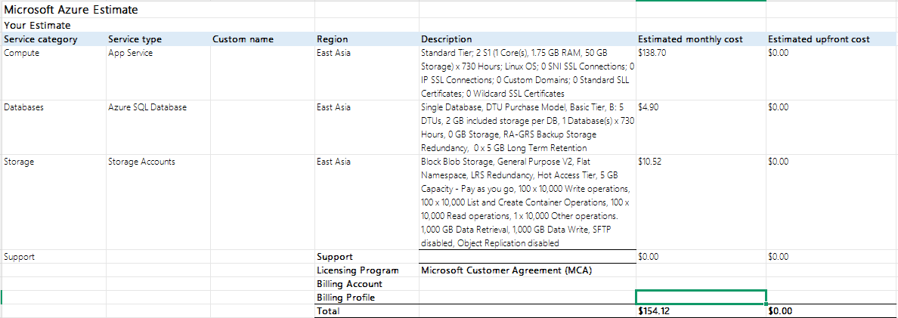

# CSEC 3 – Cloud Computing

### Cost Estimate Report

---

## 1. Architecture Summary

The deployment of the School Portal is based on a secure, highly available and scalable Azure cloud infrastructure that comprises three fundamental resources. First of all, an Azure App Service is the public facing web server that hosts the Python Flask web app, along with the public facing backend routing, and is dynamically scaled out using Azure Monitor Autoscale rules during peak traffic times. Second, an isolated Azure SQL Database is used and is strictly private to allow for announcements to be stored, keeping costs under close control operating on the Basic Tier. Last, an Azure Storage Account offers a private Blob Storage container for secure file downloads, and is configured to store files in a way that is zone-redundant (Standard_ZRS), meaning they are stored synchronously in three availability zones, resulting in enterprise-grade fault tolerance.

---

## 2. Itemized Cost Breakdown

Each resource listed below is set up based on the architectural specification, and its monthly cost is calculated using the official Azure Pricing Calculator export.

| Service Category | Service Type | Configuration Details | Monthly Runtime / Capacity | Estimated Monthly Cost (USD) |
|---|---|---|---|---|
| Compute | App Service | **OS:** Linux    **Tier:** Standard    **Instance Size:** S1 (1 Core, 1.75 GB RAM, 50 GB Storage)    **Count:** 2 instances | 730 Hours | $138.70 |
| Databases | Azure SQL Database | **Deployment:** Single Database    **Purchase Model:** DTU    **Tier:** Basic    **Performance:** 5 DTU    **Included Storage:** 2 GB | 730 Hours | $4.90 |
| Storage | Storage Accounts | **Type:** General Purpose V2 (Block Blob)    **Access Tier:** Hot    **Redundancy:** LRS / ZRS    **Baseline Capacity:** 5 GB    **Operations:** Default transaction allocations | 100 × 10,000 ops | $10.52 |
| Support | Azure Support Plan | **Tier:** Developer / Basic Tier Plan | Included | $0.00 |

---

## Total Combined Infrastructure Cost

**$154.12**

---

## Mathematical Breakdown of Totals

The cost per month of operation is the grand total of all the individual resource cost components.

$$ \text{Total Estimated Monthly Cost} = \text{Cost}_{\text{App Service}} + \text{Cost}_{\text{SQL Database}} + \text{Cost}_{\text{Storage}} $$

$$ \text{Total Estimated Monthly Cost} = 138.70 + 4.90 + 10.52 = 154.12 $$

---

## 3. Azure Pricing Calculator Screenshot Reference

---

## 4. Cost Optimization Notes

Cloud optimization strategies to reduce the baseline cost of **$154.12 per month**:

- **App Service Autoscaling:**  
  When enabled, App Service Autoscaling will scale down from 2 to 1 instance at night and on weekends, saving compute costs by **$39.14 per month (28.2%)**.

- **Azure Reserved Instances (RIs):**  
  Reserve the baseline number of instances for a 1-year or 3-year period and get up to a **35% discount** over the long term, equivalent to approximately **$48.00/month**.

- **Azure SQL Serverless Tier:**  
  Shift from the Basic tier to a vCore Serverless tier and automatically pause the database during periods of inactivity, reducing compute costs to **$0 when idle**.

- **Storage Lifecycle Policies:**  
  Automatically move course files (PDFs/rubrics) from the Hot Tier to the Cool Tier after 30 days if they are not accessed to minimize static data capacity fees.
